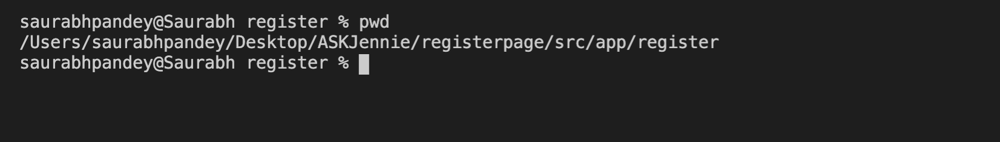

# Ask Jennie Python Package
Jennie would be a software tool that will store automated task as snap-shopts on Jennie Server.

Currently jennie is equipped, with automated task related to Angular and Django, Also we have added a way of uploading Angular component library and made it reuse-able to public using the same package

`Angular component library`: Angular Library that can be used inside any angular project as a component, these component can be a small module or a complete page as well.

*A list of UI galleries can be found at [angular.uigallery.ask-jennie.com](https://angular.uigallery.ask-jennie.com/)*

## Setup

**Setup is required to use jennie.**

```shell script
jennie setup useremail@something.com 
```

To use to library user needs to get them registered with ASK Jennie, to request registration
Mail us on : saurabh@ask-jennie.com

Registered user can simply do setup and start using Jennie.

- ## Angular Based Automations

    - ### Installing Bootstrap in Angular Project
        ```shell script
        jennie angular install bootstrap
        ```
        
        *Adds Bootsrap and Jquery to angular project*   

    - ### Adding Angular Based UI Component

        ```shell
        jennie angular add uilibname
        ```
        
        replace `uilibname` with desire gallery        
        
        **the command will create a component with the name of library, add it to project, later the library can be used using `<app-uilibname></app-uilibname>` anywhere inside projects**

- ### Uploading Angular Based UI Component
Steps to upload a UI component to Jennie.

- Create a json config file inside the component folder, the json config file will contain
```json
{
    "type": "bootstrap-ui-gallery",
    "name": "navbardark",
    "title": "Simple Bootstrap Registration Page",
    "description": "Some information about the library",
    "parameter": [{
        "parameter_name": "Name of parameter",
        "parameter_type": "string/array",
        "parameter_description": "Tell us about the parameter"
    }],
    "image_file": "/Users/saurabhpandey/Desktop/ASKJennie/uigallery/src/assets/navbar-dark.png",
    "tag": "Navbar"
}
```
`type`: `bootstrap-ui-gallery` / `ui-gallery`

`name`: `nameofcomponent`, make sure the name should not contain only alpha numaric characters.

`title`: Title for the component, the title will be displayed on ui gallery website.

`description`: Short description for the component, the description will be displayed on ui gallery website.

`image_file`: File path for image, required. Make you component live take a screenshot that's good for an image.

- Open Terminal and go project/src/app/path/to/component 


- execute
```shell
jennie angular upload bootstrap-ui-lib
```


